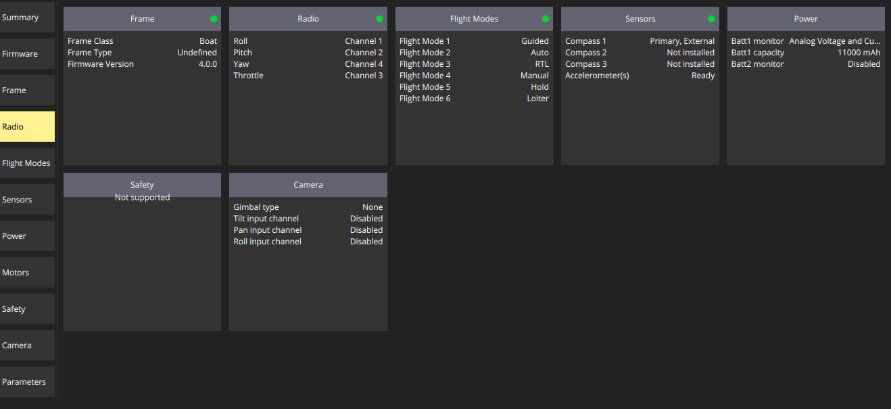
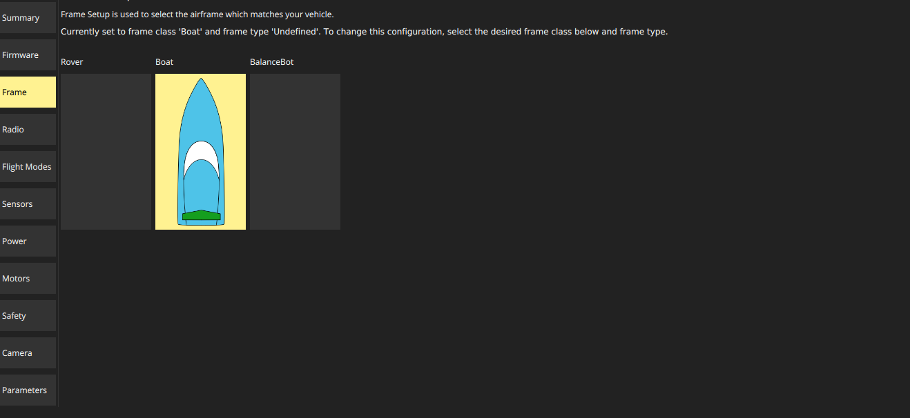
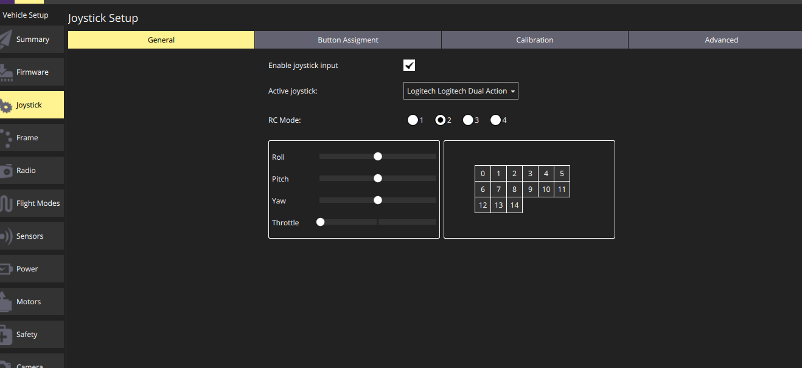
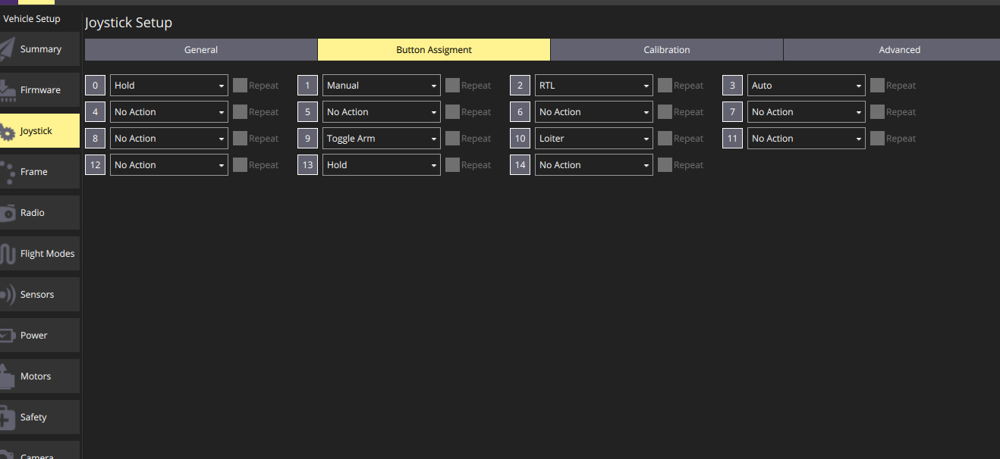
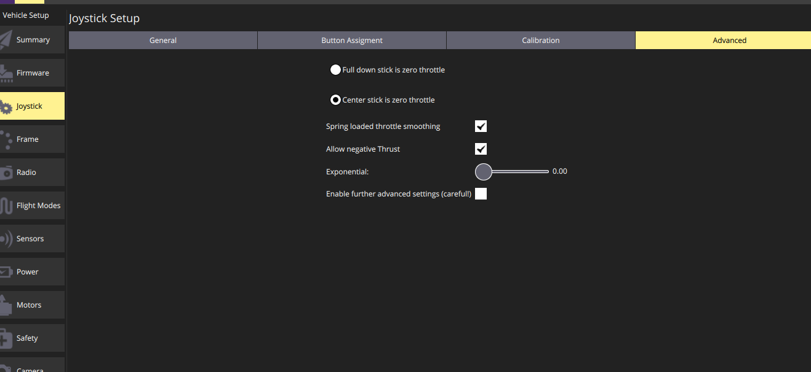
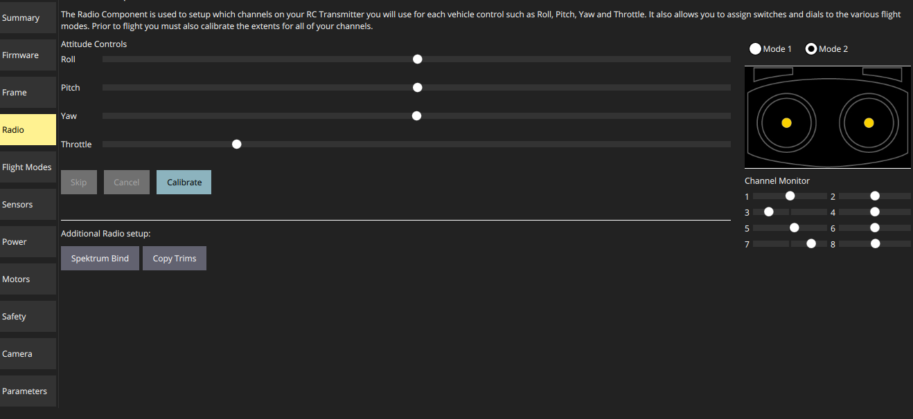
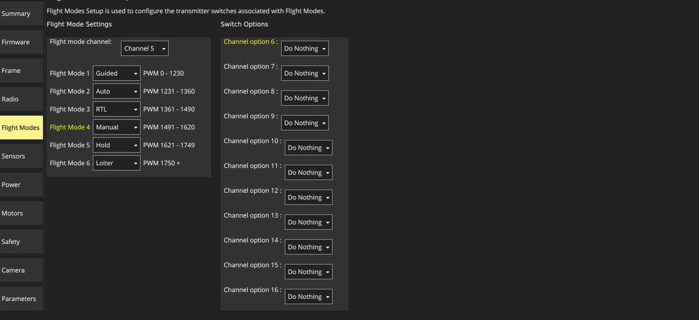
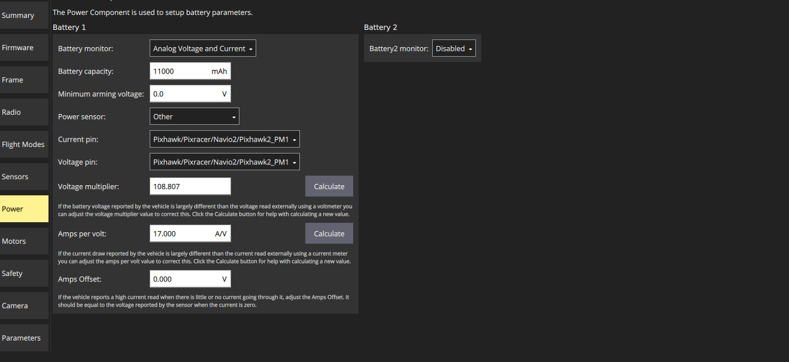

# emily-usv
Data and parameters of an EMILY USV

**Ardurover parameters file**: `emily_ardurover.params`

# Configuring Autonomous EMILY USV

This manual describes how to add autonomous capability to a standard [EMILY USV](https://www.emilyrobot.com/). This configuration has been called “Smart EMILY”. It uses a [Pixhawk Mini](https://docs.px4.io/v1.9.0/en/flight_controller/pixhawk_mini.html) flight controller with [ArduRover](https://ardupilot.org/rover/) autopilot software system. This text is a work-in-progress, since we are continually testing and improving the configuration. Follow-up documents will describe how to integrate various sensors and additional capabilities. Here, the basic setup required for waypoint-following autonomy is presented.

## Outstanding issues

1. Poor telemetry range with [SiK radios](https://ardupilot.org/copter/docs/common-sik-telemetry-radio.html). Rarely achieve ~350 ft., ~200 ft. typical, sometimes < 20 ft! Long-range [RDF900+](https://ardupilot.org/copter/docs/common-rfd900.html) on the way. 
2. Long delay to recover from GCS connection loss. `Initializing APM... EKF error... EKF failsafe... EKF failsafe cleared`. 
3. Despite setting `FS_ACTION` to `RTL`, always enters `Hold` on communication loss.
4. Unsure about voltage monitoring. See **Power** section below.

## Required materials

**Vehicle**

- [E.M.I.L.Y. ERS](https://www.emilyrobot.com/)

**Autopilot**

- [Pixhawk Mini](https://docs.px4.io/v1.9.0/en/flight_controller/pixhawk_mini.html)
- [Quad Power Distribution board](https://docs.px4.io/v1.9.0/en/flight_controller/pixhawk_mini.html)
- [Ublox GPS + compass module](https://ardupilot.org/copter/docs/common-installing-3dr-ublox-gps-compass-module.html)
- [SiK radio telemetry module](https://ardupilot.org/copter/docs/common-sik-telemetry-radio.html) **Note, will replace with long-range RFD900**
- [Spektrum DSMX receiver](https://www.horizonhobby.com/product/dsmx-remote-receiver/SPM9645.html)

**Ground control station**

- Laptop running [QGroundControl](http://qgroundcontrol.com/)
- [SiK radio telemetry module](https://ardupilot.org/copter/docs/common-sik-telemetry-radio.html) **Note, will replace with long-range RFD900**
- [Logitech Dual-Action gamepad](https://www.amazon.com/Logitech-Dual-Action-Game-Pad/dp/B0000ALFCI)

**Radio control transmitter**

- [Spektrum DX8](https://www.spektrumrc.com/Products/Default.aspx?ProdID=SPMR8000)

## Hardware integration

Section coming soon? 

1. I need to study the wiring, since I did not do this part
2. Since [CRASAR](http://crasar.org/) did this, I’m not just assuming I can share it. That said, you can figure it out from the [Pixhawk Mini wiring quick start](https://madennis.gitbooks.io/px4user/content/en/assembly/quick_start_pixhawk_mini.html).

## Software installation and configuration

### Setup GCS

The GCS is simply a laptop running QGroundControl, with a SiK telemetry dongle that communicates with the SiK telemetry attached the Pixhawk. The SiK radio pair establishes communication between the vehicle and GCS. We also have a Logitech gamepad configured to allow manual control of the vessel through the GCS software. It should be noted that there are two active connections between ground and the vehicle. Once is the telemetry link just described and the other is the RC link for radio control. The gamepad offers an alternative to the RC control. There is more [lag when using the gamepad](https://ardupilot.org/rover/docs/common-joystick.html#reducing-lag-in-the-controls), but it can be useful for situations where the vehicle has connection with the GCS but not RC. Eventually, I would like to be monitoring/controlling the vehicle from a cellular or satellite connection using gamepad or joystick indoors. 

[Install QGroundControl](https://docs.qgroundcontrol.com/master/en/getting_started/download_and_install.html)

#### Update firmware on Pixhawk Mini and SiK telemetry pair**

Use QGroundControl to [update the telemetry firmware](https://docs.qgroundcontrol.com/master/en/SetupView/Firmware.html). 

Use QGroundControl to load ArduRover onto the Pixhawk Mini. 

- Version: `ArduPilot Flight Stack` -> `Rover 4.0.0`

#### Download offline maps

Should have maps available for effective mission planning and monitoring out in the field. Follow the [QGroundControl offline maps](https://docs.qgroundcontrol.com/master/en/SettingsView/OfflineMaps.html) documentation.

### Configure ArduRover settings

Follow the [getting started guide](https://ardupilot.org/rover/docs/apmrover-setup.html) while consulting the below setup information for each section.

#### Summary

#### Frame

- Boat frame

#### Joystick

- Joystick options will only appear if gamepad is plugged in _before_ launching QGroundControl
- Highly recommend printing a laminated card with the button layout

#### Radio

Initially, I found that the roll and yaw were reversed. I first fixed it by setting parameters `RC1_REVERSED` and `RC3_REVERSED`. However, I did not like doing this since I was not sure what downstream effects this would have on the autonomy. It seems like it is better if everything is normal and default on the controller and corrected on the RC transmitter. Its trivial to do on the Spektrum DX8, but only if you realize that clicking on Travel within the Control Setup screen allows scrolling through different options to setup.

`Function List` → `Control Setup` → `Reverse` → Flip the direction on ROL and YAW.

#### Flight Modes

ArduPilot allows you to associate switch positions on the transmitter with flight modes (i.e. manual, hold, auto, …). There are six slots available to set, but the most choices available on any Spektrum DX8 switch are three. At first, I thought you would use one switch to cycle between three and a second switch to cycle between the remaining three. However, how would it disambiguate which mode to be in with two active switches? So, I found that the recommended way to enable all six is to use a two-option switch to select with half are available to the three-option switch. So, you end up with 2x3 equals six options. The setup is a bit convoluted, but I followed the steps in the [ArduRover documentation](https://ardupilot.org/rover/docs/common-rc-transmitter-flight-mode-configuration.html#spektrum-dx8-alternate-method) and it worked. Not all the words were identical between the documentation and my transmitter, but it was easy enough to guess at what to do.
Basically, you use channel mixing which allows one channel to control another. So, you setup the GEAR stick (switch A) to behave differently (output different signals) depending on the Flight Mode stick position (switch B).

Create two channel mixes:

Channel mix 1:

Channel mix 2:

#### Power

**WORK IN PROGRESS**: The EMILY uses 4 11.1V, 5500mAh LIPO batteries. From what I can tell with my extremely limited electrical knowledge, there are 2 parallel sets of 2 serial batteries. So, both the voltage and current should double. The voltmeter gave a reading of 22.3, which I used to calibrate the voltage monitor. When the boat is on, but idle, the readings are often between 28-36V; this seems odd to me. When I apply some thrust on bench, it drops to a more reasonable ~24-26V. I need to (1) figure out expected readings and (2) lock in settings to achieve them. 

Another concern: the EMILY user manual says that the voltage should be above 10V. The example in their photo is 12V. This reading is on the LCD screen on a Futaba RC that I don’t actually know how to use with Pixhawk. I wonder if the voltage was scaled for their display so that its as if it is a single 11.1V LIPO. Meaning, should I ensure the voltage is above 10V or 20V? 

#### Additional parameters

In the `parameters` tab, additional parameters are set with manual value input. 

**Disable pre-arm checks.** Ardupilot does not recommend this, since the checks are to prevent operating in a bad state. However, some of these checks are hard for a boat to deal with. For example, there is a pre-arm check for calibrated gyros. This fails is you ever reboot the vehicle while in water because it will be confused by the movement when it expects a stable craft. The smarter approach is to test each arming check to determine which should be set, but for now we are disabling all of them. 

	ARMING_CHECK          None

 **Set communiction failsafe behaviors.** Communication failsafes can occur from loss of RC transmitter and from loss of GCS telemetry. Failsafe actions determine what the vehicle will do when a loss of communication is detected. The parameter `FS_ACTION` controls communication loss and  `FS_GCS_ENABLE` applies the failsafe to GCS telemetry (and not just RC). I want to vehicle to return-to-launch (RTL) on loss, and the following settings should do so. However, I have found that the vehicle **always enters hold mode whenever anything problematic occurs**. 

	FS_ACTION          RTL
	FS_GCS_ENABLE          Enabled

**Set collection of log replay data**. With this enabled, you can replay logs within the GCS. I haven’t tried it yet, but I think I can use this to playback the actual movement of the vehicle on the map. I plan to use this for videos where the main video is the boat but the GCS screen is in the corner. 

	LOG_REPLAY          Enabled

**Set behavior for when mission is completed**. The default is to `hold` when a mission is completed, but the boat will start drifting. Instead, set it to `loiter` to maintain the position. 

	MIS_DONE_BEHAVE          Loiter

**Tuning the controller*. See controller tuning section for details. These settings worked to achieve decent path following behavior, as shown. 

	ATC_STR_ANG_P          1.0
	ATC_STR_RAT_P           0.5
	ATC_STR_RAT_FF         1.0

### Controller tuning

Tuning the controller requires some manual experimentation. See the [Rover tuning documentation](https://ardupilot.org/rover/docs/rover-tuning-steering-rate.html) for details. Then read up on my experience with [tuning the EMILY](https://ekrell.github.io/PID-tuning-EMILY/). 
